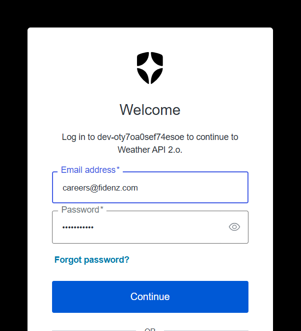
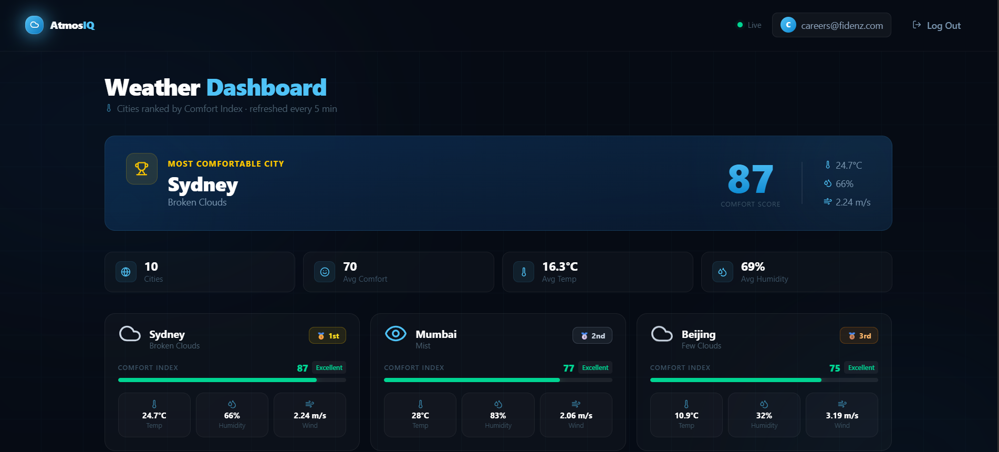
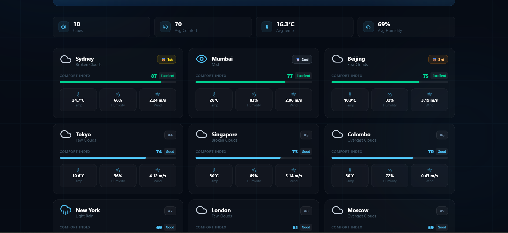

# AtmosIQ (Weather Comfort Ranking App)

AtmosIQ is a full-stack weather application that retrieves real-time weather data from the OpenWeather API, calculates a Comfort Index, and ranks cities based on overall weather comfort conditions.

The application uses a Node.js backend and a React frontend to fetch, process, and display weather information in a user-friendly interface.

## Tech Stack

Backend

* Node.js
* Express
* TypeScript
* Axios
* OpenWeather API

Frontend

* React
* Vite
* TailwindCSS
* React Router

Caching

* In-memory caching using a JavaScript Map with TTL

---

# Application Screenshots

## Application Home Page


## Login



## Logged In User Details


## Dashboard With Comfort Score



## Comfort Score Visualization



---

# Features

* Retrieves real-time weather data from OpenWeather API
* Converts temperature from Kelvin to Celsius
* Calculates a Comfort Index score between 0 and 100
* Ranks cities by weather comfort
* Implements caching to reduce repeated API requests
* Modular backend architecture using Express and TypeScript
* Modern frontend UI built with React and TailwindCSS

---

# Project Structure

```
weather-analytics
│
├── client
│   ├── public
│   ├── src
│   │   ├── app
│   │   ├── assets
│   │   ├── components
│   │   ├── features
│   │   ├── layouts
│   │   ├── pages
│   │   ├── services
│   │   ├── styles
│   │   ├── utils
│   │   ├── App.tsx
│   │   ├── main.tsx
│   │   └── index.css
│   │
│   ├── index.html
│   ├── package.json
│   └── vite.config.js
│
├── server
│   ├── src
│   │   ├── config
│   │   ├── controllers
│   │   ├── data
│   │   ├── middleware
│   │   ├── routes
│   │   ├── services
│   │   ├── types
│   │   ├── utils
│   │   ├── app.ts
│   │   └── server.ts
│   │
│   ├── package.json
│   └── tsconfig.json
│
└── README.md
```

---

# Setup Instructions

## Clone the Repository

```
git clone https://github.com/your-username/weather-analytics.git
cd weather-analytics
```

---

# Backend Setup

Navigate to the server directory.

```
cd server
```

Install dependencies.

```
npm install
```

Create a `.env` file inside the server folder.

```
OPENWEATHER_API_KEY=your_openweather_api_key
```

Run the development server.

```
npm run dev
```

Build the project.

```
npm run build
```

Run the production server.

```
npm start
```

---

# Frontend Setup

Open a new terminal and navigate to the client folder.

```
cd client
```

Install dependencies.

```
npm install
```

Run the development server.

```
npm run dev
```

Build the frontend.

```
npm run build
```

Preview the production build.

```
npm run preview
```

---

# Comfort Index Formula

The application calculates a Comfort Score between 0 and 100 based on four weather variables.

* Temperature
* Humidity
* Wind Speed
* Cloud Coverage

The score measures how close the current weather is to ideal outdoor comfort conditions.

## Ideal Weather Conditions

| Variable       | Ideal Value |
| -------------- | ----------- |
| Temperature    | 22°C        |
| Humidity       | 50%         |
| Wind Speed     | 3 m/s       |
| Cloud Coverage | 30%         |

---

# Formula Implementation

```
tempScore = 100 - Math.abs(tempC - 22) * 4
humidityScore = 100 - Math.abs(humidity - 50) * 1.2
windScore = 100 - Math.abs(windSpeed - 3) * 12
cloudScore = 100 - Math.abs(clouds - 30) * 0.5

comfortScore =
  tempScore * 0.4 +
  humidityScore * 0.25 +
  windScore * 0.2 +
  cloudScore * 0.15
```

The final result is rounded and clamped between 0 and 100.

---

# Reasoning Behind Variable Weights

Temperature (40%)

Temperature has the strongest effect on outdoor comfort. Extremely hot or cold weather reduces comfort regardless of other weather factors.

Humidity (25%)

Humidity significantly affects perceived temperature. High humidity can make warm weather feel more intense.

Wind Speed (20%)

A moderate breeze improves comfort, but strong winds can make conditions uncomfortable.

Cloud Coverage (15%)

Cloud coverage reduces direct sunlight exposure and slightly improves comfort, but its impact is smaller compared to other factors.

---

# Trade-offs Considered

Simplicity vs Accuracy

The formula is intentionally simple so it is easy to understand and maintain. More advanced meteorological formulas exist but would increase complexity.

Performance vs Data Freshness

Caching improves performance and reduces API calls but may temporarily return slightly outdated weather data.

Sequential vs Parallel Requests

Weather API requests are currently processed sequentially for simplicity. Parallel processing could improve performance.

Current Weather vs Forecast

The application uses current weather conditions rather than forecasts to keep the system simple and responsive.

---

# Cache Design

The application uses an in-memory cache implemented with a JavaScript Map.

## Cache Structure

```
type CacheEntry<T> = {
  data: T
  expiresAt: number
}
```

## Cache Storage

```
const cache = new Map<string, CacheEntry<unknown>>()
```

## Cache Functions

* getCache(key)
* setCache(key, data, ttl)
* getCacheKeys()
* clearCache()

The cache stores weather results temporarily to reduce unnecessary API calls.

---

# Temperature Conversion

OpenWeather returns temperature values in Kelvin.

The application converts Kelvin to Celsius using the following function.

```
export function kelvinToCelsius(kelvin: number): number {
  return Number((kelvin - 273.15).toFixed(1))
}
```

This ensures temperature values are easier to display and calculate.

---

# Known Limitations

* In-memory cache resets when the server restarts
* Cache is not distributed and only works for a single server instance
* Comfort score is a heuristic approximation
* Weather API requests are sequential
* Additional weather factors such as UV index and air quality are not included

---

# Future Improvements

* Replace in-memory cache with Redis
* Implement parallel API requests using Promise.all
* Add forecast-based weather comfort predictions
* Include UV index and air quality data
* Allow dynamic adjustment of comfort score weights

---

# Author

Developed as part of a weather analytics system demonstrating API integration, caching strategies, and weather comfort ranking using modern full-stack technologies.
